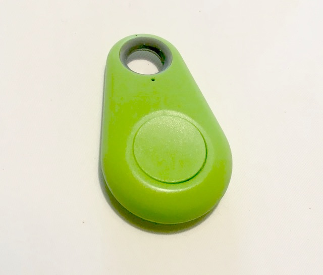

# iTag to MQTT

*work in progress*

Publish iTag button press notifications to MQTT queue.

An iTag is cheap (< 2 euro) Bluetooth Low Energy (BLE) device equipped with a button and piezzo buzzer. 

This program listens to button
press notifications, and publishes a message to a MQTT queue on press.



## Build

Requirements:

- gcc
- [GattLib](https://github.com/labapart/gattlib) (`lgattlib`)
- GLib (`lglib-2.0`)
- Paho MQTT C Client (`lpaho-mqtt3c`)

Build:

```
$ make
```

Note: since GattLib is a dependency, you can only build on Linux.

## Run

```
./button <MAC ADDR OF BUTTON>
```

## Working with iTag buttons

Although iTags seem very attractive to use as a smart button in home automation applications, especially because of their low price, there are some big caveats.

- Connection behaviour is erratic. And, it is often difficult to reconnect after disconnection.
- Range is limited.
- No difference in notification data between single, long and double click.
- Beeping on button press and connection loss is annoying. No known way of disabling these beeps. Although there seem to be iTag versions around which support [turning off the beeping](https://github.com/sylvek/itracing2/issues/77).
- Device switches off after some time, even when still connected and even when there has been regular  button press activits. When device is off, you need to turn it on again (long press on button) and reconnect.

These devices are perfect though for experimenting with the Bluetooth Low Energy and GATT protocol stacks.

And, to be fair, I should mention that iTags are not designed to be used as a smart button, their intended use is as a tracking device, to help you find your keys for example. Hence the beeping on connection loss.

iTags I have been working with were branded as Dehyaton.
 
## References

- [About bluetooth tracking tags](https://github.com/sputnikdev/eclipse-smarthome-bluetooth-binding/blob/master/tags.md)
- [Gatttool : Analyse du porte-clefs iTAG](https://www.fanjoe.be/?p=2861)

### Related projects

- [ITag MQTT bridge (NodeJS/Noble)](https://github.com/tomasgatial/itag-mqtt-bridge)